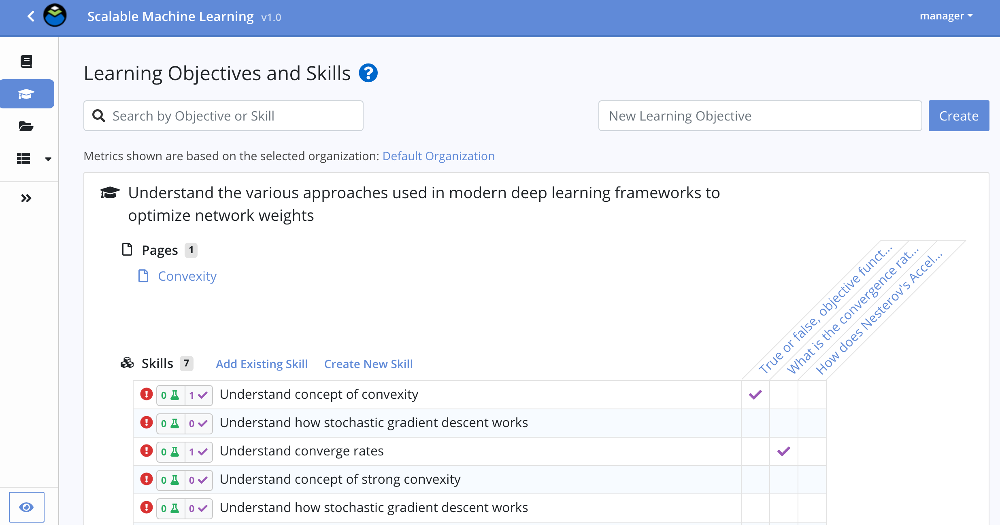

# authoring-client

Typescript/React/Redux based front-end for authoring and editing Open Learning Initiative course packages.

## WYSIWYG editing

Course authors create and maintain course materials using a familiar, WYSIWYG editing UI/UX.  

## Assessment creation

Reinforce and assess students understanding of concepts through formative and summative assessments, leveraging a variety of interactive question types. 

## Learning engineering best practices

Learning engineering best practices and design principles, exposed directly in the authoring environment, serve as guardrails
to steer an author through the development process. 

## Data analytics

Iteratively improve a course over time, guided by a rich set of learner-generated data analytics. Quickly spot problem
questions or areas of the course where learning content is not meeting the learners' needs. 

## Related repositories
* [authoring-dev](https://github.com/Simon-Initiative/authoring-dev) - Docker development environment for the course authoring platform
* [authoring-server](https://github.com/Simon-Initiative/authoring-server) - Java server, REST API, bridge to OLI
* [authoring-admin](https://github.com/Simon-Initiative/authoring-admin) - Elm admin client
* [authoring-eval](https://github.com/Simon-Initiative/authoring-eval) - Typescript/Node dynamic question evaluation engine

## License
This software is licensed under the [MIT License](./LICENSE) © 2019 Carnegie Mellon University
